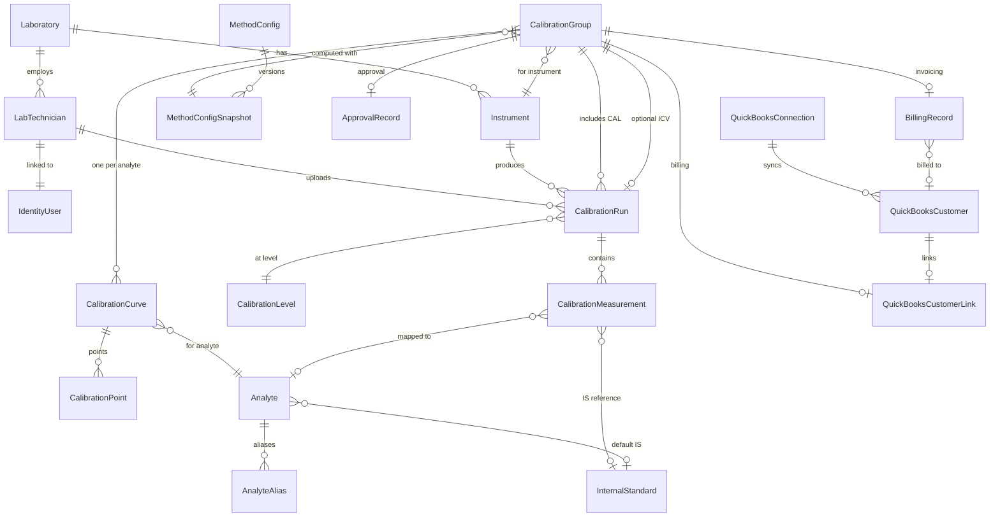

# WLTR Domain Model

## Architecture Context

The Domain project sits at the center of the Clean Architecture. It has **zero external dependencies** -- no EF Core attributes, no ASP.NET references, no NuGet packages. All entities inherit from a common `BaseEntity` that carries audit, soft-delete, and concurrency fields. EF configuration (Fluent API) will live in `Infrastructure` later.

All files go under `src/Domain/`.

## Entity Relationship Diagram




## File Structure

```
src/Domain/
  Common/
    BaseEntity.cs              -- Id, audit fields, soft delete, RowVersion
    IAuditable.cs              -- interface marker
  Enums/
    RunType.cs                 -- CAL, ICV
    WeightingMode.cs           -- None, InverseX, InverseXSquared
    RegressionType.cs          -- Average, Linear, LinearForcedZero, Quadratic
    LabelMode.cs               -- R, RSquared
    RunStatus.cs               -- Pending, Valid, ValidWithWarnings, Invalid
    CalibrationGroupStatus.cs  -- Draft, Computed, Approved, Rejected
    PointAcceptance.cs         -- Accepted, Rejected
    AnalyteCalStatus.cs        -- Pass, Fail
    ExclusionReason.cs         -- None, MissingRatio, MissingIS, InvalidX, ManualExclude, PctDiffOutOfRange
  Entities/
    Laboratory.cs
    LabTechnician.cs
    Instrument.cs
    Analyte.cs
    AnalyteAlias.cs
    InternalStandard.cs
    MethodConfig.cs
    MethodConfigSnapshot.cs
    CalibrationLevel.cs
    CalibrationRun.cs
    CalibrationMeasurement.cs
    CalibrationGroup.cs
    CalibrationCurve.cs
    CalibrationPoint.cs
    ApprovalRecord.cs
    AuditLog.cs
    QuickBooksConnection.cs
    QuickBooksCustomer.cs
    QuickBooksCustomerLink.cs
    BillingRecord.cs
```

## Base Entity

File: `src/Domain/Common/BaseEntity.cs`

```csharp
public abstract class BaseEntity
{
    public Guid Id { get; set; }
    public DateTime CreatedAt { get; set; }
    public string CreatedBy { get; set; } = string.Empty;
    public DateTime? UpdatedAt { get; set; }
    public string? UpdatedBy { get; set; }
    public bool IsDeleted { get; set; }
    public byte[] RowVersion { get; set; } = Array.Empty<byte>();
}
```

## Enums (9 files)

Each enum in its own file under `src/Domain/Enums/`. Key enums:

- `RunType { CAL, ICV }`
- `WeightingMode { None, InverseX, InverseXSquared }`
- `RegressionType { Average, Linear, LinearForcedZero, Quadratic }`
- `LabelMode { R, RSquared }`
- `RunStatus { Pending, Valid, ValidWithWarnings, Invalid }`
- `CalibrationGroupStatus { Draft, Computed, Approved, Rejected }`
- `PointAcceptance { Accepted, Rejected }`
- `AnalyteCalStatus { Pass, Fail }`
- `ExclusionReason { None, MissingRatio, MissingIS, InvalidX, ManualExclude, PctDiffOutOfRange }`

## Entity Details (20 entities)

### 1. Laboratory

```csharp
public class Laboratory : BaseEntity
{
    public string Name { get; set; }
    public string Address { get; set; }
    public string? City { get; set; }
    public string? State { get; set; }
    public string? ZipCode { get; set; }
    public string? AccreditationId { get; set; }
    public string? ContactName { get; set; }
    public string? ContactEmail { get; set; }
    public string? ContactPhone { get; set; }
    public bool IsActive { get; set; } = true;

    public ICollection<Instrument> Instruments { get; set; }
    public ICollection<LabTechnician> Technicians { get; set; }
}
```

### 2. LabTechnician

Links an ASP.NET Identity user to a laboratory. The `IdentityUserId` is a `string` matching Identity's key type. No direct reference to the Identity `User` class (that lives in Infrastructure).

```csharp
public class LabTechnician : BaseEntity
{
    public string IdentityUserId { get; set; }
    public Guid LaboratoryId { get; set; }
    public string FirstName { get; set; }
    public string LastName { get; set; }
    public string? Qualifications { get; set; }
    public DateTime? HireDate { get; set; }
    public bool IsActive { get; set; } = true;

    public Laboratory Laboratory { get; set; }
    public ICollection<CalibrationRun> UploadedRuns { get; set; }
}
```

### 3. Instrument

```csharp
public class Instrument : BaseEntity
{
    public Guid LaboratoryId { get; set; }
    public string Name { get; set; }           // e.g. "MS4", "FID5"
    public string? InstrumentType { get; set; } // e.g. "GC/MS", "IC", "FID", "ICP-MS"
    public string? Manufacturer { get; set; }   // e.g. "Agilent", "Metrohm"
    public string? Model { get; set; }
    public string? SerialNumber { get; set; }
    public bool IsActive { get; set; } = true;

    public Laboratory Laboratory { get; set; }
    public ICollection<CalibrationRun> CalibrationRuns { get; set; }
    public ICollection<CalibrationGroup> CalibrationGroups { get; set; }
}
```

### 4. Analyte

```csharp
public class Analyte : BaseEntity
{
    public string Name { get; set; }               // canonical name: "Benzene"
    public string? CasNumber { get; set; }
    public Guid? DefaultInternalStandardId { get; set; }

    public InternalStandard? DefaultInternalStandard { get; set; }
    public ICollection<AnalyteAlias> Aliases { get; set; }
}
```

### 5. AnalyteAlias

```csharp
public class AnalyteAlias : BaseEntity
{
    public Guid AnalyteId { get; set; }
    public string AliasName { get; set; }   // raw compound name from instrument

    public Analyte Analyte { get; set; }
}
```

### 6. InternalStandard

```csharp
public class InternalStandard : BaseEntity
{
    public string Name { get; set; }           // e.g. "Fluorobenzene"
    public string? CasNumber { get; set; }

    public ICollection<Analyte> Analytes { get; set; }
}
```

### 7. MethodConfig (latest active config, mutable by Admin)

```csharp
public class MethodConfig : BaseEntity
{
    public string Name { get; set; }
    public RegressionType DefaultRegressionType { get; set; }
    public WeightingMode DefaultWeightingMode { get; set; }
    public bool ForceZeroIntercept { get; set; }
    public LabelMode LabelMode { get; set; }
    public double MinCorrelation { get; set; }       // min r or R²
    public double MaxRSE { get; set; }
    public double PctDiffLowBound { get; set; }
    public double PctDiffHighBound { get; set; }
    public int MinPointsRequired { get; set; }
    public int MaxMissedPoints { get; set; }
    public double IcvLimitPercent { get; set; }
    public int CurrentVersion { get; set; }

    public ICollection<MethodConfigSnapshot> Snapshots { get; set; }
}
```

### 8. MethodConfigSnapshot (immutable version captured at compute time)

```csharp
public class MethodConfigSnapshot : BaseEntity
{
    public Guid MethodConfigId { get; set; }
    public int Version { get; set; }
    public string ConfigJson { get; set; }     // full serialized config at that version

    public MethodConfig MethodConfig { get; set; }
}
```

### 9. CalibrationLevel

```csharp
public class CalibrationLevel : BaseEntity
{
    public string LevelName { get; set; }          // "Cal_1ppb", "Cal_10ppb"
    public double TrueConcentration { get; set; }  // mapped numeric value
    public int SortOrder { get; set; }
}
```

### 10. CalibrationRun

```csharp
public class CalibrationRun : BaseEntity
{
    public RunType RunType { get; set; }
    public Guid InstrumentId { get; set; }
    public Guid? CalibrationLevelId { get; set; }
    public Guid UploadedByTechnicianId { get; set; }
    public DateTime RunDate { get; set; }
    public RunStatus Status { get; set; }
    public string RawText { get; set; }
    public string TextHash { get; set; }           // SHA-256

    // Parsed metadata
    public string? DataPath { get; set; }
    public string? DataFile { get; set; }
    public string? AcquiredOn { get; set; }
    public string? Operator { get; set; }
    public string? MethodName { get; set; }
    public string? SampleName { get; set; }

    public Instrument Instrument { get; set; }
    public CalibrationLevel? CalibrationLevel { get; set; }
    public LabTechnician UploadedByTechnician { get; set; }
    public ICollection<CalibrationMeasurement> Measurements { get; set; }
}
```

### 11. CalibrationMeasurement

```csharp
public class CalibrationMeasurement : BaseEntity
{
    public Guid CalibrationRunId { get; set; }
    public Guid? AnalyteId { get; set; }           // null if unresolved
    public string RawCompoundName { get; set; }
    public double? RetentionTime { get; set; }
    public double? QuantIon { get; set; }
    public double Response { get; set; }            // raw area/signal
    public double? CalculatedConcentration { get; set; }
    public double? InternalStandardResponse { get; set; }
    public double? ResponseRatio { get; set; }      // response / IS response
    public int? SourceLineNumber { get; set; }
    public string? ValidationMessage { get; set; }

    public CalibrationRun CalibrationRun { get; set; }
    public Analyte? Analyte { get; set; }
}
```

### 12. CalibrationGroup

```csharp
public class CalibrationGroup : BaseEntity
{
    public Guid InstrumentId { get; set; }
    public Guid? IcvRunId { get; set; }
    public Guid? MethodConfigSnapshotId { get; set; }
    public CalibrationGroupStatus Status { get; set; }
    public DateTime? ComputedAt { get; set; }
    public string? ComputationVersion { get; set; }

    public Instrument Instrument { get; set; }
    public CalibrationRun? IcvRun { get; set; }
    public MethodConfigSnapshot? MethodConfigSnapshot { get; set; }
    public ApprovalRecord? ApprovalRecord { get; set; }
    public QuickBooksCustomerLink? CustomerLink { get; set; }
    public BillingRecord? BillingRecord { get; set; }
    public ICollection<CalibrationRun> CalRuns { get; set; }
    public ICollection<CalibrationCurve> Curves { get; set; }
}
```

### 13. CalibrationCurve

```csharp
public class CalibrationCurve : BaseEntity
{
    public Guid CalibrationGroupId { get; set; }
    public Guid AnalyteId { get; set; }
    public RegressionType RegressionType { get; set; }
    public WeightingMode WeightingMode { get; set; }
    public bool ForcedZero { get; set; }

    // Regression coefficients
    public double Slope { get; set; }
    public double Intercept { get; set; }
    public double? QuadraticCoefficient { get; set; }  // 'a' for quadratic

    // Intermediate sums (for debug/audit)
    public double S0 { get; set; }
    public double Sx { get; set; }
    public double Sy { get; set; }
    public double Sxx { get; set; }
    public double Sxy { get; set; }
    public double Denominator { get; set; }

    // Statistics
    public double SSE { get; set; }
    public double SST { get; set; }
    public double RSE { get; set; }
    public double RSquared { get; set; }
    public double? CorrelationR { get; set; }          // sqrt(R²) if label mode = r

    // Acceptance
    public int IncludedPointCount { get; set; }
    public int ExcludedPointCount { get; set; }
    public AnalyteCalStatus CalStatus { get; set; }
    public string? FailureReasonsJson { get; set; }    // serialized list of reasons

    // ICV results (if ICV present)
    public double? IcvTrueConcentration { get; set; }
    public double? IcvCalculatedConcentration { get; set; }
    public double? IcvPercentDiff { get; set; }
    public bool? IcvPassed { get; set; }

    public CalibrationGroup CalibrationGroup { get; set; }
    public Analyte Analyte { get; set; }
    public ICollection<CalibrationPoint> Points { get; set; }
}
```

### 14. CalibrationPoint

```csharp
public class CalibrationPoint : BaseEntity
{
    public Guid CalibrationCurveId { get; set; }
    public Guid CalibrationRunId { get; set; }
    public Guid? CalibrationLevelId { get; set; }
    public double X { get; set; }                  // true concentration
    public double Y { get; set; }                  // response ratio (or raw response if no IS)
    public double Weight { get; set; }
    public double? PredictedY { get; set; }
    public double? Residual { get; set; }
    public double? PercentDiff { get; set; }
    public bool IsIncluded { get; set; } = true;
    public PointAcceptance? Acceptance { get; set; }
    public ExclusionReason ExclusionReason { get; set; }
    public string? ExclusionNote { get; set; }     // user-entered reason for manual exclusion
    public string? ExcludedByUserId { get; set; }
    public DateTime? ExcludedAt { get; set; }

    public CalibrationCurve CalibrationCurve { get; set; }
    public CalibrationRun CalibrationRun { get; set; }
    public CalibrationLevel? CalibrationLevel { get; set; }
}
```

### 15. ApprovalRecord

```csharp
public class ApprovalRecord : BaseEntity
{
    public Guid CalibrationGroupId { get; set; }
    public string ReviewerUserId { get; set; }
    public string ReviewerName { get; set; }
    public DateTime ApprovedAt { get; set; }
    public string? Comment { get; set; }

    public CalibrationGroup CalibrationGroup { get; set; }
}
```

### 16. AuditLog

```csharp
public class AuditLog
{
    public Guid Id { get; set; }
    public string UserId { get; set; }
    public DateTime Timestamp { get; set; }
    public string ActionType { get; set; }
    public string EntityType { get; set; }
    public string EntityId { get; set; }
    public string? OldValue { get; set; }      // JSON
    public string? NewValue { get; set; }      // JSON
    public string? TraceId { get; set; }
}
```

Note: `AuditLog` does NOT inherit `BaseEntity` -- it is append-only, never updated or soft-deleted.

### 17-20. QuickBooks Entities

**QuickBooksConnection** -- stores OAuth tokens for the connected company:

```csharp
public class QuickBooksConnection : BaseEntity
{
    public string RealmId { get; set; }
    public string AccessToken { get; set; }
    public string RefreshToken { get; set; }
    public DateTime AccessTokenExpiresAt { get; set; }
    public DateTime RefreshTokenExpiresAt { get; set; }
    public bool IsActive { get; set; }
    public string? EnvironmentMode { get; set; }   // "sandbox" or "production"
}
```

**QuickBooksCustomer** -- synced customer master data:

```csharp
public class QuickBooksCustomer : BaseEntity
{
    public string QuickBooksCustomerId { get; set; }
    public string DisplayName { get; set; }
    public string? CompanyName { get; set; }
    public string? PrimaryEmail { get; set; }
    public string? PrimaryPhone { get; set; }
    public bool IsActive { get; set; }
    public DateTime LastSyncedAt { get; set; }
}
```

**QuickBooksCustomerLink** -- associates a CalibrationGroup with a customer:

```csharp
public class QuickBooksCustomerLink : BaseEntity
{
    public Guid CalibrationGroupId { get; set; }
    public Guid QuickBooksCustomerId { get; set; }

    public CalibrationGroup CalibrationGroup { get; set; }
    public QuickBooksCustomer QuickBooksCustomer { get; set; }
}
```

**BillingRecord** -- invoice tracking:

```csharp
public class BillingRecord : BaseEntity
{
    public Guid CalibrationGroupId { get; set; }
    public Guid? QuickBooksCustomerId { get; set; }
    public string? QuickBooksInvoiceId { get; set; }
    public string? InvoiceStatus { get; set; }
    public decimal? TotalAmount { get; set; }
    public decimal? Balance { get; set; }
    public DateTime? SyncedAt { get; set; }
    public string? FailureReason { get; set; }

    public CalibrationGroup CalibrationGroup { get; set; }
    public QuickBooksCustomer? QuickBooksCustomer { get; set; }
}
```

## Key Design Decisions

- `**double` for all calibration math fields** -- matches Excel 64-bit floating-point for deterministic parity
- `**decimal` for billing amounts** -- financial precision for QuickBooks invoicing
- `**string` for `IdentityUserId` / `ReviewerUserId`** -- Domain layer does not reference ASP.NET Identity; the string ID is the bridge
- `**AuditLog` is standalone** -- no BaseEntity inheritance, no soft delete, purely append-only
- `**MethodConfigSnapshot.ConfigJson`** -- full serialized config frozen at compute time for historical reproducibility
- `**CalibrationCurve` stores intermediate sums** (S0, Sx, Sy, Sxx, Sxy, Den) -- required for regression debug endpoint and QA verification
- **Navigation properties declared** but no EF attributes -- Fluent API config will be in Infrastructure
- `**ICollection<T>`** for navigation collections -- EF will materialize as `HashSet<T>` or `List<T>`

